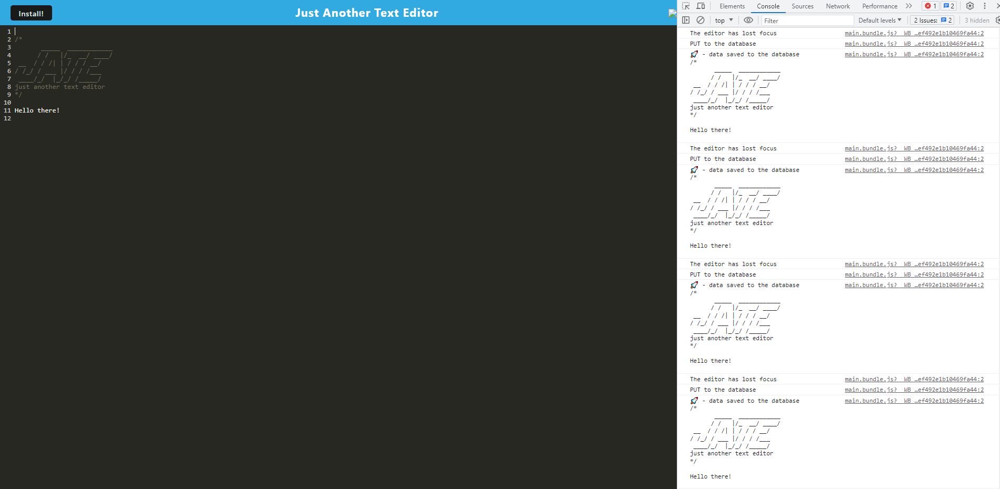

# MyTextEditor

## Description
This is a text editor. You can write stuff and it will remember it!

## Usage
To use this app, simply go [here](). Once on the page, you can install the application by clicking on the install button. You then type what you want in the editor, and it auto save as you go!

## Screenshot

## Live URL

## Credit
My GitHub profil is [Valerigionetnoel](https://github.com/Valerigionetnoel) you can email me [here](mailto:valeri.gionetnoel@gmail.com)

## License

Refer to license in repo for more information.